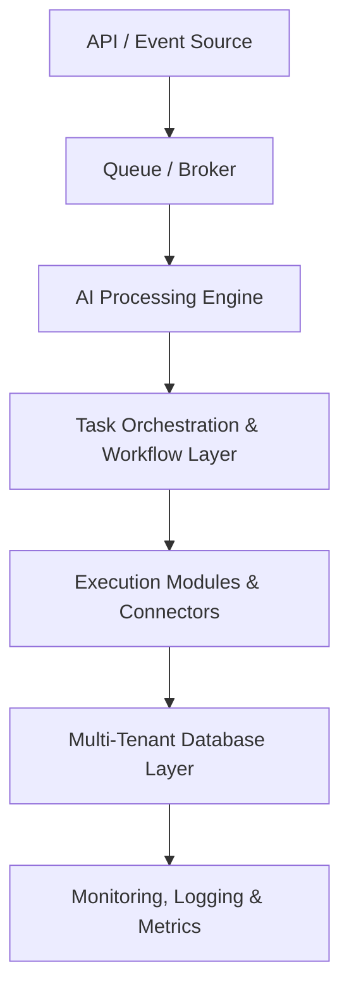

# ⚡ QuantumOps AI

Backend-first, enterprise-grade SaaS platform for intelligent task orchestration and AI-driven business process execution. Event-driven architecture with full GitLab CI/CD and DigitalOcean deployment support.

**[Features](#-features)** •
**[Architecture](#-architecture)** •
**[Tech Stack](#-tech-stack)** •
**[Impact](#-real-world-impact)** •
**[Contributing](#-contributing)**

---

## 🎯 Overview

**QuantumOps AI** is a backend-first, enterprise-grade SaaS platform that provides intelligent task orchestration, AI-driven analytics, and automated business process execution. Designed for enterprises and high-scale SaaS products with full **GitLab CI/CD** and **DigitalOcean** deployment support.

### Key Capabilities:

- 🤖 **AI Workflow Engine** - Multi-step backend process automation with dynamic orchestration
- 📊 **Predictive Analytics** - Forecasts, anomaly detection, and actionable insights
- 📡 **Event-Driven** - High-throughput event handling with guaranteed delivery
- 🏢 **Multi-Tenant** - Secure isolation of tenants, workflows, and data
- 🔌 **Extensible** - Custom AI models, workflow modules, and connectors
- 📈 **Real-Time Monitoring** - Observe AI decisions and system health
- 🔒 **Enterprise Security** - Encryption, RBAC, and audit logs
- 🚀 **Massive Scale** - Thousands of concurrent workflows
- 🔄 **GitLab CI/CD** - Fully automated pipelines and deployments
- ☁️ **DigitalOcean Ready** - Optimized for droplets and Kubernetes

---

## ✨ Features

| Feature | Description |
|---------|-------------|
| 🤖 **AI Workflow Engine** | Automate multi-step backend processes with dynamic task orchestration |
| 📊 **Predictive Analytics** | AI models provide forecasts, anomaly detection, and insights |
| 📡 **Event-Driven Architecture** | High-throughput event handling using queues and message brokers |
| 🏢 **Multi-Tenant Architecture** | Secure isolation of tenants, workflows, and data pipelines |
| 🔌 **Plugin System** | Extendable with custom AI models and workflow connectors |
| 📈 **Real-Time Monitoring** | Observe AI decisions, task execution, and system health |
| 🔐 **Security & Compliance** | Encryption, RBAC, and detailed audit logs |
| 🚀 **Highly Scalable** | Supports thousands of concurrent workflows with auto-scaling |
| 🔄 **GitLab CI/CD** | Fully automated testing, build, and deployment pipelines |
| ☁️ **DigitalOcean Ready** | Optimized for droplets, Kubernetes, and managed databases |

---

## 🏗️ Architecture

### System Components

| Component | Purpose |
|-----------|---------|
| **Queue / Broker** | Handles high-volume event streams with guaranteed delivery |
| **AI Processing Engine** | Executes predictive, classification, and optimization models |
| **Task Orchestration** | Coordinates multi-step workflows and dependent tasks |
| **Execution Modules** | Interfaces with external APIs, SaaS systems, and endpoints |
| **Database Layer** | Securely stores workflow data and AI outputs per tenant |
| **Monitoring & Metrics** | Prometheus/Grafana dashboards for performance tracking |

---

## 📈 Real-World Impact

| Benefit | Achievement |
|---------|-------------|
| 🤖 **Automation** | Fully automates backend workflows across SaaS platforms |
| 🧠 **Intelligence** | AI-driven logic improves operational efficiency |
| 🏢 **Multi-Tenancy** | Enables SaaS companies to scale securely |
| 🚀 **Rapid Deployment** | CI/CD pipelines ensure quick feature releases |
| 🔍 **Reliability** | Real-time monitoring ensures uptime and compliance |

---

## 🛠️ Tech Stack

### Backend
- **Language:** Python 3.11
- **Framework:** FastAPI
- **Task Queue:** Celery + Redis
- **API:** GraphQL

### AI/ML
- **LLM:** OpenAI GPT / Gemini API
- **Models:** Custom reinforcement learning and predictive models

### Infrastructure
- **Primary Database:** PostgreSQL
- **Document Store:** MongoDB
- **Cache & Queue:** Redis
- **Message Queue:** RabbitMQ, Kafka
- **Containerization:** Docker
- **Orchestration:** Kubernetes, Helm
- **Cloud:** DigitalOcean (Droplets, Managed Kubernetes)

### CI/CD & DevOps
- **Pipelines:** GitLab CI/CD
- **Testing:** Automated unit and integration tests
- **Monitoring:** Prometheus & Grafana
- **Logging:** ELK stack

---

## 🔐 Security & Compliance

- **Authentication:** JWT with Multi-Factor Authentication (MFA)
- **Authorization:** Fine-grained Role-Based Access Control (RBAC)
- **Encryption:** End-to-end encryption for data in transit and at rest
- **Data Isolation:** Complete tenant separation at system level
- **Audit Logging:** Complete activity tracking and reporting
- **Compliance:** GDPR, HIPAA, SOC 2 ready
- **Rate Limiting:** API throttling and DDoS protection
- **Secrets Management:** GitLab secure variables and vaults

---

## 🤝 Contributing

Contributions are welcome! Please follow these guidelines:

1. Fork the repository
2. Create a feature branch (`git checkout -b feature/AmazingFeature`)
3. Commit your changes (`git commit -m 'Add AmazingFeature'`)
4. Push to the branch (`git push origin feature/AmazingFeature`)
5. Open a Pull Request

---

## 📄 License

MIT License © rouviour-german

See [LICENSE](LICENSE) for details.

---

---

---

---

## Author & Contact

- **GitHub:** [@rouviour-german](https://github.com/rouviour-german)
- **Email:** [rouviourgermanmeetings@gmail.com](mailto:rouviourgermanmeetings@gmail.com)
- **Profile:** https://github.com/rouviour-german

